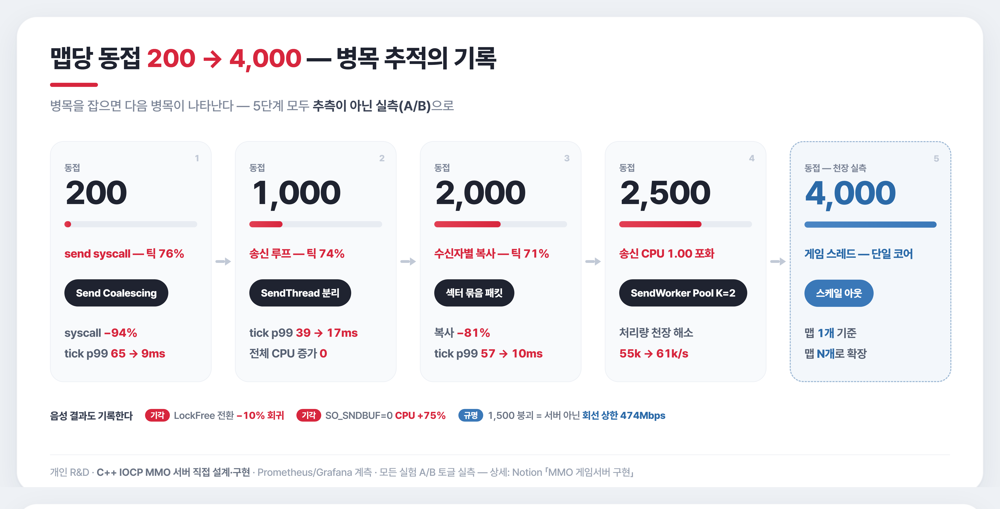

# MMO Game Server

[](https://cocoz93.github.io/portfolio/)

**Windows IOCP 기반 C++ MMO 게임서버** — 동접 **200 → ~5,000**까지 병목을 단계별로 추적·해소한 개인 성능 R&D 프로젝트입니다.
모든 최적화는 추측이 아니라 **A/B 실측**(Prometheus·Grafana 계측)으로 검증했습니다.

## 🔗 링크
- 🌐 **WEB PROFILE** — https://cocoz93.github.io/portfolio/
- 🍀 **기술경력서** — [Notion 바로가기](https://feline-vacation-d6d.notion.site/23316a0b9f59809db2e5d610a23a10a5?source=copy_link)
- 📚 **DEV LOG 26** — [노션 블로그 전체](https://feline-vacation-d6d.notion.site/DEV-LOG-26-2db16a0b9f598196a471d53775ab4223?source=copy_link)
- 📧 **Email** — wndnwls7@gmail.com

## 🛠 기술 스택
C++17 · Windows IOCP · WinSock · Prometheus · Grafana

## 📂 구조
| 폴더 | 설명 |
|------|------|
| `IOCP_Server/` | 서버 본체 — 네트워크·게임 로직 |
| `GameClient/` | 테스트용 클라이언트 |
| `StressTest/` | 부하 테스트 하네스 |
| `Monitoring/` | Prometheus·Grafana 계측 설정 |
| `Shared/` | 공용 코드 |
| `Run/` | 실행 스크립트 |
| `img/` | 성능 실험 인포그래픽 (소스는 각 폴더 `_src/`) |

## ⚠️ 빌드 전제 — LockFree 저장소가 나란히 있어야 합니다

락프리 자료구조(큐·스택·메모리풀)는 이 저장소에 사본을 두지 않고
[**LockFree 저장소**](https://github.com/cocoz93/LockFree)를 **직접 참조**합니다.
예전엔 사본을 복사해 뒀다가 양쪽이 갈라져 결함 수정이 서버에 반영되지 않는 일이 있어, 사본을 없앴습니다.

두 저장소를 **같은 부모 폴더에** 나란히 두세요:

```
<부모폴더>/
├─ MMO/         ← 이 저장소
└─ LockFree/    ← https://github.com/cocoz93/LockFree
```

연결은 프로젝트 설정이 아니라 소스에 있습니다 — `IOCP_Server/IOCP_Server/LockFreeConfig.h`
한 파일이 상대경로로 저장소 헤더를 직접 include 합니다(락프리를 쓰는 코드는 이 헤더만 include).
폴더가 없으면 이렇게 실패합니다:

```
LockFreeConfig.h(45,10): error C1083: 포함 파일을 열 수 없습니다.
                         '../../../LockFree/LockFree_Test/LockFree/InternalFreeList.h'
```

빌드는 **`IOCP_Server/IOCP_Server.sln`** 으로 하세요.
프로젝트 파일(`.vcxproj`)만 빌드하면 실행 파일이 `Run/bin/` 이 아닌 다른 경로에 생성돼,
실행 스크립트가 예전 바이너리를 쓰게 됩니다. (x64 전용 — 128비트 CAS를 써서 Win32는 빌드되지 않습니다)

## ▶️ 실행

빌드 산출물은 `Run/bin/` 에 생깁니다. 아래 배치는 모두 `Run/` 폴더에 있습니다.

**1) 그냥 떠 있는지만 보고 싶을 때** — 서버 + 콘솔 클라이언트, 계측 없음

```
Run\0. simple_test.bat
```

**2) 부하 + 계측 한 번에** — 서버 · 부하 클라이언트 · Prometheus · Grafana를 순서대로 기동합니다

```
Run\3. MMO_stress.bat
```

| 주소 | 무엇 |
|------|------|
| http://localhost:3000 | Grafana 대시보드 (프로비저닝 완료 상태로 뜹니다) |
| http://localhost:9091 | Prometheus UI |
| http://localhost:9090 | 서버가 직접 노출하는 원본 지표 |

동접 수·워커 수 등은 `Run/bin/IOCP_ServerConfig.ini` 와 `Run/bin/MMOStressConfig.ini` 에서 바꿉니다.
부하 클라이언트를 **다른 PC**에서 돌리려면 `3-1.`(서버 전용) 과 `3-2.`(클라 전용) 를 나눠 실행하고,
서버 주소는 `Run/stress_client_ip.txt` 에 적으세요 (`stress_client_ip.txt.example` 참고).

**3) A/B 실측 뽑기** — 부하를 **5분 이상** 돌린 뒤에 수집해야 합니다 (그 전엔 표본이 모자라 빈 결과가 납니다)

```powershell
cd Monitoring
.\metrics-collect.ps1 -RunLabel A_baseline     # 변종마다 한 번
.\metrics-collect.ps1 -RunLabel B_variant
.\metrics-compare.ps1 -Baseline A_baseline -Variant B_variant
```

결과 CSV는 `Monitoring/metrics_out/` 에 떨어지고, 비교는 Δ%와 판정을 함께 출력합니다.
스윕 자동화는 `Run/wtk-sweep.ps1`(워커×송신워커 교차) · `Run/clientcount-sweep.ps1`(동접 천장) ·
`Run/affinity-ab.ps1`(코어 격리 A/B) 에 있습니다.

## 📄 라이선스

코드는 MIT — [LICENSE](LICENSE)

단, `WebClient/assets/` 의 픽셀 스프라이트·타일은 별도입니다.
[Universal LPC Spritesheet Character Generator](https://github.com/sanderfrenken/Universal-LPC-Spritesheet-Character-Generator)
및 LPC(Liberated Pixel Cup) 기여자들의 저작물로 **CC-BY-SA** 이며, 재배포 시 같은 조건을 따라야 합니다.
개별 크레딧은 `WebClient/assets/*.js` 첫 줄과 [WebClient/README.md](WebClient/README.md) 에 있습니다.
