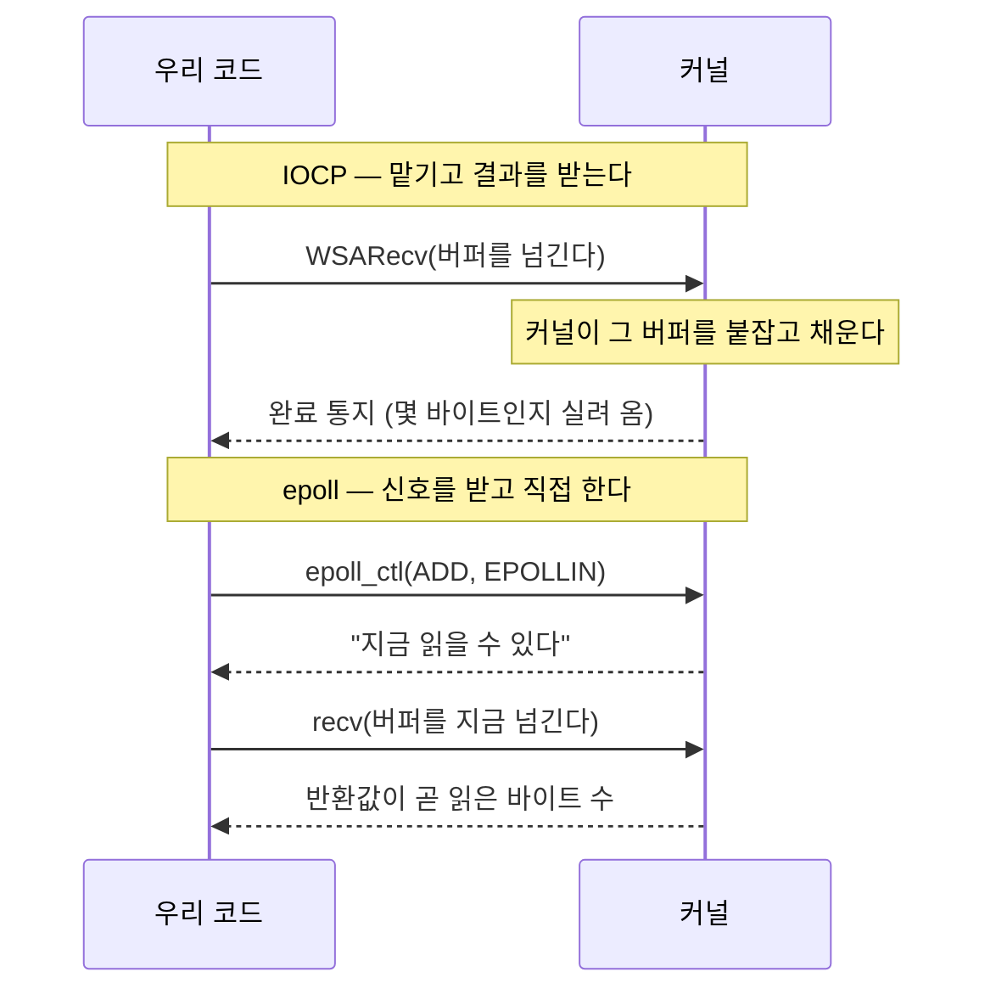

<!-- 스냅샷: 2026-08-04T05:25:48Z (A0에서 1곳 수정 반영) · 페이지 ID 3b216a0b9f5981d08403ed47cdb409bc · 제목 "👁️ epoll" -->

<callout icon="🧭" color="blue_bg">
	이 문서는 **IOCP는 손에 익었지만 epoll은 처음인** 사람을 위한 것이다. 모든 설명을 "IOCP에서는 어땠는데, epoll에서는 어떻게 되는가"의 대비로 한다.
	목적은 epoll 일반론이 아니라 **우리 서버의 ****`Transport_Epoll.cpp`****를 읽을 수 있게 만드는 것**이다. 그래서 개념 하나마다 그 개념이 실제로 나타난 코드 줄번호를 붙였다.
</callout>
<callout icon="📌" color="gray_bg">
	**범위** — 리눅스 epoll, 레벨 트리거 기준. 줄번호 인용은 전부 `IOCP_Server/IOCP_Server/Transport_Epoll.cpp`이며, 다른 파일은 이름을 밝혔다.
	**아직 안 쓴 것** — `EPOLLET`·`EPOLLEXCLUSIVE`·`SO_REUSEPORT`는 우리 코드에 없다. 왜 없는지는 8장에.
	**이 개념이 실제로 무엇을 부쉈는지**는 따로 있다 → [3. 두 모델 차이가 터진 곳](https://app.notion.com/p/3b216a0b9f598182af58f74c4416bc45) · 전체 요약은 [1. 왜 옮겼나 · 결과](https://app.notion.com/p/3b216a0b9f5981b8a152f7b69a6fa5b0)
</callout>
<table_of_contents/>
---
# 1. 한눈에 — 준비 통지란 무엇인가
한 줄로 줄이면 이렇다.
> **IOCP는 일을 맡기고 결과를 받는다. epoll은 신호를 받고 일을 직접 한다.**
IOCP에서 우리가 하던 것은 "이 버퍼로 받아 달라"고 **걸어두는** 일이었다. 커널이 다 받으면 완료를 돌려주고, 거기에 몇 바이트인지가 실려 온다. 이런 방식을 **완료 통지**(proactor)라고 부른다.
epoll은 아무것도 걸어두지 않는다. "이 소켓이 읽을 수 있게 되면 알려 달라"고 **등록**할 뿐이다. 통지가 오면 그때 내가 직접 `recv`를 부른다. 이것이 **준비 통지**(reactor)다.

이 차이 하나에서 나머지가 전부 따라 나온다. 다음 장에서 셋으로 정리한다.
# 2. IOCP를 아는 사람에게 — 뒤집히는 것 셋
<callout icon="1️⃣" color="gray_bg">
	**버퍼를 누가 쥐고 있나.**
	IOCP는 `WSARecv`에 버퍼를 넘긴다. 그 순간부터 완료가 올 때까지 **커널이 그 버퍼를 붙잡고 있고**, 우리는 건드리면 안 된다. 그래서 "어느 요청의 완료인가"를 표시할 `OVERLAPPED`가 요청마다 필요했다.
	epoll은 등록할 때 버퍼를 넘기지 않는다. 통지를 받은 뒤 `recv`를 부르며 그 자리에서 버퍼를 준다. **버퍼는 처음부터 끝까지 우리 것**이고, 그래서 `OVERLAPPED`에 해당하는 물건이 아예 없다.
</callout>
<callout icon="2️⃣" color="gray_bg">
	**몇 바이트인지 어디서 아나.**
	IOCP는 완료 통지에 전송 바이트 수가 실려 온다. epoll은 통지에 그런 게 없다 — **`recv`****와 ****`writev`****의 반환값이 그 자리에서 알려준다**(`:414`, `:222`).
	통지는 "지금 하면 된다"까지만 말하고, 실제로 얼마나 됐는지는 해봐야 안다.
</callout>
<callout icon="3️⃣" color="gray_bg">
	**누가 깨어나나.**
	IOCP는 완료 포트가 깨울 스레드를 **커널이 골랐고**, 동시에 몇 개나 돌게 할지(concurrency)까지 조절해 줬다.
	epoll에는 그런 개념이 없다. `epoll_wait`에 들어가 있는 워커들이 알아서 깨어난다(`:66-68` 주석). 이 하나가 스레드 설계를 바꾼다 — 6장에서 따로 본다.
</callout>
# 3. 용어 대응표
IOCP를 안다면 이 표가 절반이다.
<table fit-page-width="true" header-row="true">
<tr>
<td>**IOCP**</td>
<td>**epoll**</td>
<td>**무엇이 달라지나**</td>
</tr>
<tr>
<td>`WSARecv` / `WSASend` (걸어둔다)</td>
<td>`recv` / `writev` (통지 뒤 직접 부른다)</td>
<td>제출이 아니라 **실행**이다. 반환값이 곧 결과</td>
</tr>
<tr>
<td>`GetQueuedCompletionStatus`</td>
<td>`epoll_wait`</td>
<td>완료를 걷는 것 → **준비된 fd 목록**을 받는 것</td>
</tr>
<tr>
<td>완료 포트 (프로세스 1개, 워커가 공유)</td>
<td>epoll 인스턴스 (`_epollFd`, 역시 공유)</td>
<td>여기까지는 모양이 같다</td>
</tr>
<tr>
<td>`CreateIoCompletionPort`(소켓을 포트에 연결)</td>
<td>`epoll_ctl(EPOLL_CTL_ADD)` (`:149`)</td>
<td>**무엇을 알려줄지**(`EPOLLIN`)까지 같이 정한다</td>
</tr>
<tr>
<td>`CompletionKey` (소켓마다)</td>
<td>`ev.data.ptr` (`:147`)</td>
<td>같은 역할 — 통지에서 세션을 바로 찾는다</td>
</tr>
<tr>
<td>`OVERLAPPED` (요청마다)</td>
<td>**대응물 없음**</td>
<td>걸어두는 요청이 없으니 표시할 것도 없다</td>
</tr>
<tr>
<td>`CancelIoEx` (걸린 I/O 취소)</td>
<td>**대응물 없음** — `epoll_ctl(DEL)` 뒤 `shutdown` (`:320-321`)</td>
<td>취소할 I/O 자체가 없다. **종료 설계가 바뀐다**</td>
</tr>
<tr>
<td>`PostQueuedCompletionStatus` (가짜 완료로 워커 깨우기)</td>
<td>**대응물 없음** — `epoll_wait` 타임아웃 100ms (`:36`, `:117-118`)</td>
<td>종료 시 워커를 깨울 방법이 없어 **주기적으로 확인**한다</td>
</tr>
</table>
<callout icon="🔑" color="yellow_bg">
	표에서 "대응물 없음"이 셋이다. 그리고 그 셋이 실제로 손이 많이 간 자리였다 — 걸어두는 요청이 없다는 사실 하나가 **종료 설계**(`CancelIoEx`)와 **워커 깨우기**(`PostQueuedCompletionStatus`)를 동시에 무너뜨린다.
</callout>
# 4. 레벨 트리거와 엣지 트리거 ★
두 방식의 차이는 한 문장이다.
- **레벨 트리거(LT)** — 조건이 참인 **동안 계속** 알려준다. 읽을 게 남아 있으면 다음에도 또 알려준다
- **엣지 트리거(ET)** — 상태가 **바뀌는 순간만** 알려준다. 새로 도착했을 때 한 번
우리는 **레벨 트리거**를 쓴다. `epoll_ctl`에 `EPOLLET`을 주지 않았고(`:146`, `:282`), 플래그를 안 주면 레벨 트리거가 기본이다.
## 고른 게 아니라, 구조가 그걸 전제한다
여기가 이 장의 핵심이다. "LT가 쉬우니까 골랐다"가 아니라, **지금 코드는 LT가 아니면 데이터를 잃는다.**
`EpollHandleReadable`은 수신 링에 빈 자리가 없으면 **덜 읽고 그냥 나온다**(`:409-412`).
```c++
char* writePtr = session->_recvQ.GetWritePtr();
const size_t writable = session->_recvQ.GetDirectWriteSize();
if (writable == 0)
    break;   // 링이 찼다 — 게임 스레드가 비우면 다음 통지에서 이어 읽는다
```
주석이 말하는 "다음 통지"가 **레벨 트리거라서 오는 것**이다. 커널 수신 버퍼에 데이터가 남아 있는 한 `epoll_wait`이 계속 그 소켓을 준비 상태로 돌려준다.
<callout icon="🚫" color="red_bg">
	**엣지 트리거였다면 그 데이터는 영영 안 깨어난다.**
	`man epoll`이 이 상황을 그대로 예로 든다 — 2KB가 도착해 통지를 받고 **1KB만 읽으면**, 엣지 트리거에서는 다음 `epoll_wait`이 *"despite the available data still present in the file input buffer"* 그대로 멈춰 있을 수 있다("might block indefinitely"). 상대는 이미 보낸 데이터에 대한 응답을 기다리는데 말이다.
	우리 코드의 "링이 차서 덜 읽고 나온다"가 정확히 그 1KB만 읽은 상황이다.
</callout>
<callout icon="⚠️" color="orange_bg">
	그래서 **ET로 바꾸는 것은 플래그 하나 추가가 아니다.** ET에서는 "`EAGAIN`이 날 때까지 전부 읽는다"가 강제되는데, 우리는 링이 차면 더 읽을 곳이 없다. 게임 스레드가 링을 비울 때까지 **어딘가에 담아둘 자리**를 새로 만들어야 한다.
	ET는 8장의 튜닝 후보로 남겨 뒀고, 손대려면 수신 구조부터 봐야 한다.
</callout>
# 5. `EPOLLOUT`을 평소에 꺼두는 이유
소켓은 **대개 쓸 수 있는 상태**다. 커널 송신 버퍼에 자리가 있으면 언제나 "쓰기 준비됨"이다.
그래서 `EPOLLOUT`을 평소에 걸어두면, 보낼 것이 하나도 없어도 통지가 **끝없이 온다.** 워커는 깨어나서 "보낼 게 없네" 하고 다시 자기를 반복한다(`:174` 주석).
우리 방식은 이렇다.
- 평소에는 `EPOLLIN`만 등록한다 (`:146`)
- `writev`가 요청보다 적게 보냈거나 `EAGAIN`이 나면 — 즉 **커널 버퍼가 찼을 때만** `EPOLLOUT`을 건다 (`:233-247`)
- 남은 것을 다 보내면 **즉시 해제**한다 (`:262-263` → `EpollUpdateWriteInterest`)
<callout icon="💡" color="gray_bg">
	`EpollUpdateWriteInterest`는 **상태가 같으면 ****`epoll_ctl`****을 아예 안 부른다**(`:274`).
	이게 없으면 송신할 때마다 "끄기" 시스템 호출이 한 번씩 추가된다. 대부분의 송신은 한 번에 다 나가므로, 그 대부분에서 불필요한 호출이 된다.
</callout>
# 6. 스레드 모델이 왜 따라 바뀌는가
2장의 3️⃣이 여기서 실제 문제가 된다.
**IOCP**는 완료 포트가 스레드를 관리해 줬다. 몇 개를 깨울지(concurrency)를 커널이 조절하므로, 워커를 코어 수보다 많이 만들어도 실제로 도는 것은 제한됐다.
**epoll**에는 그런 장치가 없다. 워커 전원이 같은 `_epollFd`를 두고 `epoll_wait`에 들어가 있고(`:337-349`), 통지가 오면 알아서 깨어난다. 커널이 교통정리를 해주지 않는다.
## 그래서 잠금이 필요해진다
같은 세션의 통지로 **여러 워커가 동시에 들어올 수 있다.** 우리는 세 겹으로 막는다.
<table fit-page-width="true" header-row="true">
<tr>
<td>**무엇**</td>
<td>**어디**</td>
<td>**막는 것**</td>
</tr>
<tr>
<td>`AcquireSession` / `IOCountDecrement`</td>
<td>`:404`, `:446`</td>
<td>처리 중에 세션이 반환·재사용되는 것</td>
</tr>
<tr>
<td>`_sendSubmitBusy`</td>
<td>`:183`</td>
<td>두 스레드가 같은 링 구간을 겹쳐 보내는 것 (순서 붕괴)</td>
</tr>
<tr>
<td>`_disconnecting` 게이트</td>
<td>`:314`</td>
<td>종료 경로가 두 번 도는 것</td>
</tr>
</table>
<callout icon="🕳️" color="gray_bg">
	**게임 스레드도 송신을 부른다.** 틱 끝에 `TransportFlushDirty`가 `EpollSendSession`을 직접 호출한다(`:299-307`).
	즉 같은 세션에 **게임 스레드와 epoll 워커가 동시에 ****`writev`****할 수 있다.** `_sendSubmitBusy`가 그걸 막는다. 이 잠금은 **공통 골격에 원래 있던 것**이다 — IOCP 팔도 제출자가 둘(송신 워커 + 완료 워커의 이어보내기)이라 같은 잠금을 쓴다. epoll에서 바뀌는 것은 **누가 제출자인가**뿐이다.
</callout>
# 7. 소스 지도
코드를 직접 열 때의 위치. 전부 `Transport_Epoll.cpp`이고, Windows 빌드에서는 파일 전체가 빈 번역단위가 된다.
<table fit-page-width="true" header-row="true">
<tr>
<td>**심볼**</td>
<td>**줄**</td>
<td>**역할**</td>
</tr>
<tr>
<td>`TransportPreListen`</td>
<td>`:64`</td>
<td>`epoll_create1` — 인스턴스 생성. 워커 수 산정도 여기</td>
</tr>
<tr>
<td>`TransportAttachSession`</td>
<td>`:137`</td>
<td>논블로킹 전환 + `epoll_ctl(ADD)`로 `EPOLLIN` 등록</td>
</tr>
<tr>
<td>`TransportStartFirstRecv`</td>
<td>`:159`</td>
<td>**빈 함수** — epoll엔 "수신을 걸어둔다"가 없다</td>
</tr>
<tr>
<td>`EpollWorkerThread`</td>
<td>`:337`</td>
<td>`epoll_wait` 루프. 준비 통지를 갈라 처리</td>
</tr>
<tr>
<td>`EpollHandleReadable`</td>
<td>`:399`</td>
<td>`recv` 루프 → 골격의 `ProcessRecv`로</td>
</tr>
<tr>
<td>`EpollSendSession`</td>
<td>`:175`</td>
<td>`writev` (링이 감기면 `iovec` 2개) + 부분 전송 처리</td>
</tr>
<tr>
<td>`EpollUpdateWriteInterest`</td>
<td>`:272`</td>
<td>`EPOLLOUT` 등록/해제 — 남았을 때만 켠다</td>
</tr>
<tr>
<td>`TransportRequestDisconnect`</td>
<td>`:311`</td>
<td>`epoll_ctl(DEL)` 뒤 `shutdown`, **그리고 직접 ****`IOCountDecrement`**</td>
</tr>
</table>
<callout icon="🔑" color="yellow_bg">
	마지막 줄이 이 백엔드에서 가장 중요한 한 곳이다. IOCP에서는 **완료 통지가 참조를 놓아 줬다** — `CancelIoEx`가 걸린 I/O를 실패로 완료시키고, 그 완료를 받은 워커가 `IOCountDecrement`를 불렀다.
	epoll에는 걸린 I/O가 없어 그 통지가 **영영 오지 않는다.** 그래서 등록을 빼는 자리에서 직접 놓아 준다(`:324-331`). 이걸 빼먹었을 때의 증상은 "세션이 만들어지기만 하고 하나도 안 죽는다"였다.
</callout>
# 8. 아직 안 쓴 것
우리 코드에 **없는** 것들이다. 없다는 사실 자체가 튜닝 여지다.
<table fit-page-width="true" header-row="true">
<tr>
<td>**기능**</td>
<td>**무엇을 하나**</td>
<td>**왜 아직 안 썼나**</td>
</tr>
<tr>
<td>`EPOLLET`</td>
<td>엣지 트리거 — 통지 횟수를 줄인다</td>
<td>4장 참고. 수신 구조가 LT를 전제해서, 바꾸려면 링이 찼을 때 담아둘 자리가 먼저 필요하다</td>
</tr>
<tr>
<td>`EPOLLEXCLUSIVE`</td>
<td>한 이벤트에 워커 하나만 깨운다 (thundering herd 완화)</td>
<td>6장의 잠금으로 정확성은 지켜지고 있다. 성능 이득은 **측정 전**</td>
</tr>
<tr>
<td>`SO_REUSEPORT`</td>
<td>리슨 소켓을 워커마다 따로 둬 accept 경합을 없앤다</td>
<td>지금은 accept 스레드 하나. 접속 폭주가 병목인지 **측정 전**</td>
</tr>
<tr>
<td>`TCP_NODELAY`</td>
<td>Nagle 알고리즘 해제</td>
<td>**주석 처리되어 있다** (`IOCPServer.cpp:314`). 양 팔 공통이라 epoll만의 문제가 아니다</td>
</tr>
</table>
<callout icon="🎯" color="yellow_bg">
	**성능 수치는 아직이다.** 위 넷은 전부 "재보고 정할 것"이고, 지금 단계는 정확성 검증까지다. 측정 환경(실기 리눅스)이 준비되면 A/B로 판정한다.
	특히 **송신 워커 분리**가 1순위다 — Windows 쪽에서 같은 변경으로 tick p99가 39.18ms → 17.38ms로 떨어진 실측이 있다. 지금 리눅스 팔은 게임 스레드가 직접 `writev`를 부른다.
</callout>
---
## 직접 확인해 보기
읽고 넘어가지 말고 손으로 확인할 수 있는 것들이다. 전부 WSL(`Ubuntu-24.04`)에서 바로 된다.
**① 레벨 트리거와 엣지 트리거의 차이 — 원문으로**
```bash
man epoll
# "Level-triggered and edge-triggered" 절.
# 2KB 도착 → 1KB만 읽음 → 다음 epoll_wait이 멈춘다는 그 예제가 4장의 근거다
```
**② 우리가 정말 ****`EPOLLET`****을 안 쓰는지**
```bash
grep -rn "EPOLLET\|EPOLLEXCLUSIVE\|SO_REUSEPORT" IOCP_Server/ --include=*.cpp --include=*.h
# ThirdParty/httplib.h 두 줄만 걸린다(SO_REUSEPORT) — 우리 코드에는 없다
```
**③ 등록하는 이벤트가 무엇인지**
```bash
grep -n "ev.events" IOCP_Server/IOCP_Server/Transport_Epoll.cpp
# :146  EPOLLIN | EPOLLRDHUP            ← 평소
# :282  ... | (wantWrite ? EPOLLOUT : 0) ← 보낼 게 남았을 때만
```
**④ "빈 함수"들이 정말 비어 있는지** — epoll에 대응물이 없다는 것을 눈으로 확인하는 방법이다.
```bash
sed -n '157,164p;386,395p' IOCP_Server/IOCP_Server/Transport_Epoll.cpp
# TransportStartFirstRecv, PostRecv — 둘 다 인자를 (void)로 버리고 끝난다
```
