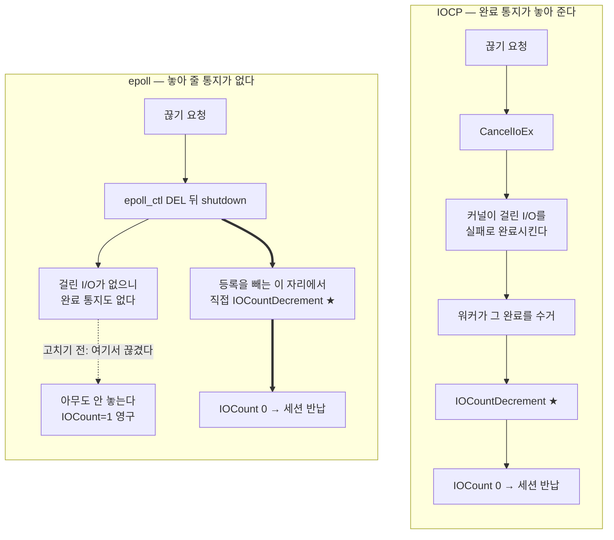

<!-- 스냅샷: 2026-08-04T06:00:23Z (A0에서 1곳 수정 후 재취득) · 페이지 ID 3b216a0b9f598182af58f74c4416bc45 · 제목 "🔀 3. 두 모델 차이가 터진 곳" -->

<callout icon="🔀" color="blue_bg">
	이 시리즈의 핵심이다. **골격은 거의 그대로 옮겨졌고, 진짜로 문제가 된 곳은 딱 두 군데였다.**
	둘 다 같은 원인에서 나온다 — IOCP는 "일이 끝났다"는 통지가 오는데, epoll에는 그 통지가 없다. 통지가 없다는 사실 하나가 **세션의 수명**과 **송신 구조**를 동시에 무너뜨렸다.
</callout>
<callout icon="📌" color="gray_bg">
	**먼저 읽으면 좋은 것** — 완료 통지와 준비 통지의 차이가 아직 낯설다면 [epoll](https://app.notion.com/p/3b216a0b9f5981d08403ed47cdb409bc) 페이지를 먼저 보면 이 문서가 훨씬 쉽게 읽힌다. 여기서는 그 차이가 **실제로 무엇을 부쉈는지**만 다룬다.
	줄번호 인용은 전부 `IOCP_Server/IOCP_Server/Transport_Epoll.cpp`.
</callout>
<table_of_contents/>
---
# 1. 골격은 그대로였다
옮기기 전에 가장 걱정한 것은 "세션 관리를 다시 짜야 하나"였다. 결과는 아니었다.
**세션 인덱스 스택 · uniqueId 발급 · 참조 카운트 · 패킷 분해 · 게임 스레드 연동 · 세션 타임아웃 — 한 줄도 옮기지 않았다.** 이것들은 전부 공통 골격(`IOCPServer.cpp`)에 있고, OS가 갈리는 지점은 **"제출하고 수거하는 방식"** 하나뿐이었다.
그래서 리눅스 백엔드는 파일 하나로 끝난다 — `Transport_Epoll.cpp`. Windows의 `Transport_Iocp.cpp`·`Transport_Rio.cpp`와 나란히 놓이는 세 번째 팔이다.
<callout icon="✅" color="green_bg">
	**세션 타임아웃이 이 말을 가장 잘 보여준다 — 코드를 한 줄도 안 고쳤다.**
	`CTimingWheel`은 `std::thread`·`steady_clock`·`sleep_for`만 쓰고(`TimingWheel.h`), 생명주기를 건드리는 두 호출도 공통 골격에 있다 — `ProcessAccept`가 등록(`IOCPServer.cpp:477`), `ProcessRecv`가 갱신(`:494`)을 부른다. epoll 팔이 손대야 할 자리가 없었다.
	확인은 **대조로** 했다 — 무응답 클라와 하트비트 클라를 함께 붙이고 70초를 기다렸다. **무응답만 끊기고 하트비트는 살아남았다**(`session_timed_out` 1). 둘 다 끊겼다면 수명 갱신이 죽은 것이다 — 한쪽만 보면 몰랐을 자리다. (`SESSION_TIMEOUT_SEC = 60`, `IOCPServer.h:535`)
</callout>
# 2. 확장점을 새로 팔 필요가 없었다
처음 계획은 달랐다. **OS마다 서버 클래스를 따로 두고**(`CEpollServer` 같은) 그중 하나를 고르는 구조를 생각했고, 그 고르는 자리로 `NetIoModel.h`를 만들었다.
그런데 그 사이 **전송 계층이 ****`Transport_*.cpp`****로 이미 갈라졌다.** RIO를 붙이면서 생긴 구조다. 그러자 클래스를 나눌 이유가 사라졌다 — 갈리는 것은 제출·수거 방식뿐이고 나머지는 공통이니, 파일 하나만 더 놓으면 됐다.
지금 `NetIoModel.h`에 남은 것은 이게 전부다.
```c++
using NetIoModel = CIOCPServer;   // 클래스는 하나. 갈리는 건 Transport_*.cpp
```
<callout icon="🔑" color="yellow_bg">
	**확장점을 미리 파둔 것이 도움이 안 됐다.** 정작 확장은 그쪽이 아니라 **이미 뚫려 있던 다른 자리**에서 일어났다.
	교훈을 억지로 뽑자면 이렇다 — 확장점은 필요해질 때 만드는 편이 낫다. 미리 만든 자리는 정작 필요한 순간에 모양이 안 맞고, 그때는 이미 다른 곳에 더 자연스러운 자리가 생겨 있다.
</callout>
# 3. 참조를 누가 놓는가 ★
## 증상 — 세션이 만들어지기만 하고 안 죽었다
뼈대를 올리고 클라가 붙는 것까지 확인한 뒤, 지표를 보니 이랬다.
```plain text
mmo_sessions_created   1
mmo_sessions_destroyed 0
mmo_session_count      1     ← 끊었는데도 그대로
```
접속을 끊어도 슬롯이 안 돌아온다. **100명이 들락날락하면 슬롯이 말라 접속을 못 받게 되는 결함**이다.
## 원인 — 놓아 줄 사람이 사라졌다
우리 세션은 참조 카운트(`IOCount`)로 수명을 관리한다. 0이 되면 반납된다. 문제는 **그 마지막 1을 누가 놓느냐**가 두 모델에서 다르다는 것이었다.

IOCP에서는 `CancelIoEx`가 걸려 있던 I/O를 **실패로 완료**시킨다. 그 완료가 워커에 도착하고, 워커가 `IOCountDecrement`를 부른다. 즉 **완료 통지가 참조를 놓아 주는 구조**다.
epoll에는 걸어둔 I/O가 없다. 그러니 실패시킬 것도, 돌아올 완료도 없다. **그 통지는 영영 오지 않는다.**
## 깨달은 것 — `IOCount=1`의 의미가 다르다
<callout icon="🔑" color="yellow_bg">
	IOCP에서 세션 생성 시의 `IOCount=1`은 **"pending I/O가 하나 걸려 있다"**는 뜻이었다.
	epoll에서 같은 `1`은 **"이 세션이 epoll에 등록되어 있다"**는 뜻이다. 숫자는 같은데 가리키는 사실이 다르다.
	그래서 놓는 자리도 달라진다 — **등록을 빼는 곳이 곧 참조를 놓는 곳**이다.
</callout>
`TransportRequestDisconnect`가 `epoll_ctl(DEL)`과 `shutdown` 다음에 직접 `IOCountDecrement`를 부른다(`:330`). 이 경로가 두 번 돌면 참조가 하나 더 빠지므로, `_disconnecting` 게이트(`:314`)가 한 번만 통과시킨다 — IOCP 팔과 같은 방식이다.
## 검증
<table fit-page-width="true" header-row="true">
<tr>
<td>**시나리오**</td>
<td>**created**</td>
<td>**destroyed**</td>
<td>**count**</td>
</tr>
<tr>
<td>접속·해제 100회 반복</td>
<td>100</td>
<td>100</td>
<td>**0**</td>
</tr>
<tr>
<td>동시 20개 접속 중</td>
<td>20</td>
<td>0</td>
<td>20</td>
</tr>
<tr>
<td>동시 20개 해제 후</td>
<td>20</td>
<td>20</td>
<td>**0**</td>
</tr>
</table>
<callout icon="⚠️" color="orange_bg">
	**이 차이는 수신·송신 경로에도 그대로 적용된다.** epoll에서는 "완료가 참조를 놓아 준다"는 전제를 어디서도 쓸 수 없다.
	그래서 `EpollHandleReadable`(`:404`, `:446`)과 `EpollSendSession`(`:177`, `:265`)은 **함수 안에서 잡고 놓는 짝을 직접 맞춘다.** 진입에 `AcquireSession`, 탈출 경로마다 `IOCountDecrement`다.
</callout>
# 4. 제출과 완료가 붙어버린다 ★
## `writev`는 기다릴 것을 남기지 않는다
IOCP의 송신은 두 박자였다. `WSASend`로 **걸어두고**, 나중에 완료 통지로 **몇 바이트 나갔는지 받는다**. 그 사이에 "지금 몇 개가 날아가고 있나"를 적어두는 장부가 필요했다.
`writev`는 한 박자다. 부르면 그 자리에서 보낸 바이트를 돌려준다. 기다릴 것이 없다.
```c++
const ssize_t n = ::writev(sock, iov, iovCount);
...
session->_sendQ.MarkSubmitted(n);      // 제출 경계 전진
session->_sendQ.ConsumeSubmitted(n);   // 읽기 위치 전진 — 바로 다음 줄이다
```
IOCP였다면 위 두 줄 사이에 **완료를 기다리는 구간**이 있다. epoll에서는 그 구간이 없어서 두 줄이 붙는다(`:230-231`).
## 그래서 안 쓰는 것들
<table fit-page-width="true" header-row="true">
<tr>
<td>**골격의 장치**</td>
<td>**IOCP에서의 역할**</td>
<td>**epoll에서**</td>
</tr>
<tr>
<td>슬롯 링</td>
<td>여러 개 걸어둔 송신을 슬롯으로 관리</td>
<td>**안 쓴다.** 걸어둔 것이 없다</td>
</tr>
<tr>
<td>`_sendInFlight`</td>
<td>날아가는 중인 요청의 장부</td>
<td>**안 쓴다.** 이미 끝난 일을 적을 곳이 없다</td>
</tr>
<tr>
<td>`_sendDepth`</td>
<td>동시에 몇 개까지 걸어둘지</td>
<td>**1 고정.** 깊이라는 개념이 성립하지 않는다</td>
</tr>
</table>
## 그럼 부분 전송은
커널 송신 버퍼가 차면 `writev`가 요청보다 **적게** 보내거나 `EAGAIN`을 준다. 그때만 `EPOLLOUT`을 걸어 "보낼 수 있게 되면 알려 달라"고 부탁하고, 통지가 오면 이어서 보낸다(`:233-247`). 다 보내면 즉시 해제한다.
즉 **다중 pending의 자리를 ****`EPOLLOUT`**** 한 비트가 대신한다.** 장부 대신 "아직 남았다"는 표시 하나다.
## 검증
<table fit-page-width="true" header-row="true">
<tr>
<td>**항목**</td>
<td>**값**</td>
</tr>
<tr>
<td>서버가 보냈다고 기록한 바이트</td>
<td>1,064</td>
</tr>
<tr>
<td>클라 12개가 실제로 받은 합계</td>
<td>**1,064 — 완전 일치, 유실 0**</td>
</tr>
<tr>
<td>송신 패킷 / `writev` 호출</td>
<td>44 / 22 → **2패킷당 1회**</td>
</tr>
<tr>
<td>`partial_send` · `send_queue_overflow` · `send_contention`</td>
<td>0 · 0 · 0</td>
</tr>
</table>
<callout icon="✅" color="green_bg">
	**틱 끝 묶음 송신(코얼레싱)이 그대로 살아 있다.** 패킷 44개가 `writev` 22번으로 나갔다.
	이건 Windows에서 syscall을 94% 줄여준 구조인데, 전송 방식이 바뀌어도 **묶는 자리가 게임 스레드 쪽이라 그대로 옮겨졌다.** 모델이 IOCP든 epoll이든 유지할 값어치가 있는 구조다.
</callout>
# 5. 제출자가 둘이라는 것
같은 세션을 둘이 동시에 보내려 하면 순서가 깨진다. epoll에서는 그 둘이 이렇다.
- **게임 스레드**가 틱 끝에 `TransportFlushDirty` → `EpollSendSession`을 부른다 (`:299-307`)
- **epoll 워커**도 `EPOLLOUT` 통지를 받으면 같은 함수를 부른다 (`:377-378`)
즉 **같은 세션에 두 스레드가 동시에 ****`writev`****할 수 있다.** 링버퍼의 같은 구간을 겹쳐 보내면 순서가 깨진다.
```c++
if (InterlockedExchange(&session->_sendSubmitBusy, TRUE) == TRUE)
{
    _monitor._sendContention.Inc();   // 겹친 횟수를 지표로 남긴다
    IOCountDecrement(session);
    return;
}
```
이 잠금이 **"제출 구간 계산 \~ ****`writev`****"** 전체를 덮는다(`:183-260`). 이 잠금은 epoll 때문에 생긴 것이 아니다 — **IOCP 팔에서 먼저 필요했고**(송신 워커와 완료 워커의 이어보내기가 겹친다), 그 공통 골격을 그대로 쓴다. 바뀐 것은 제출자의 정체뿐이다.
<callout icon="💡" color="gray_bg">
	겹친 횟수를 `send_contention` 지표로 노출해 뒀다. 위 검증에서 **0**이었다 — 지금 부하에서는 두 스레드가 실제로 부딪히지 않는다는 뜻이다.
	이 값이 오르기 시작하면 그때가 **송신 워커를 분리할 때**다 — 현재 미완이고, [1. 왜 옮겼나 · 결과](https://app.notion.com/p/3b216a0b9f5981b8a152f7b69a6fa5b0)의 「남은 것」에 순서를 적어 뒀다.
</callout>
# 6. 소스 지도
<table fit-page-width="true" header-row="true">
<tr>
<td>**무엇**</td>
<td>**어디**</td>
</tr>
<tr>
<td>참조를 직접 놓는 자리 ★</td>
<td>`Transport_Epoll.cpp:330` (주석은 `:324-331`)</td>
</tr>
<tr>
<td>한 번만 통과시키는 게이트</td>
<td>`:314`</td>
</tr>
<tr>
<td>즉시 완료 — 제출과 소비가 붙은 두 줄</td>
<td>`:230-231`</td>
</tr>
<tr>
<td>부분 전송 → `EPOLLOUT`</td>
<td>`:233-247` → `EpollUpdateWriteInterest` `:272`</td>
</tr>
<tr>
<td>제출 잠금(공통 골격)</td>
<td>`:183-260`</td>
</tr>
<tr>
<td>수신 쪽 참조 짝</td>
<td>`:404` (잡기) · `:446` (놓기)</td>
</tr>
<tr>
<td>확장점 이름표</td>
<td>`NetIoModel.h:18`</td>
</tr>
</table>
---
## 직접 확인해 보기
**① 참조를 놓는 자리가 정말 거기인지**
```bash
sed -n '309,332p' IOCP_Server/IOCP_Server/Transport_Epoll.cpp
# 주석 :324-331이 "IOCP와 결정적으로 다른 곳"이라고 표시해 뒀다
```
**② 제출과 소비가 정말 붙어 있는지**
```bash
sed -n '224,239p' IOCP_Server/IOCP_Server/Transport_Epoll.cpp
# MarkSubmitted 바로 다음 줄이 ConsumeSubmitted다
```
**③ 세션이 실제로 반납되는지** — 서버를 띄우고 붙었다 끊은 뒤 지표를 본다.
```bash
curl -s localhost:9090/metrics | grep -E 'mmo_session_(created|destroyed)_total|mmo_session_count'
# created와 destroyed가 같고 count가 0이면 정상 (포트는 INI MonitorPort, 기본 9090)
```
**④ 코얼레싱이 살아 있는지**
```bash
curl -s localhost:9090/metrics | grep -E 'mmo_send_packets_total|mmo_wsa_send_calls_total'
# 패킷 수가 호출 수보다 크면 묶여 나가고 있다는 뜻
```
